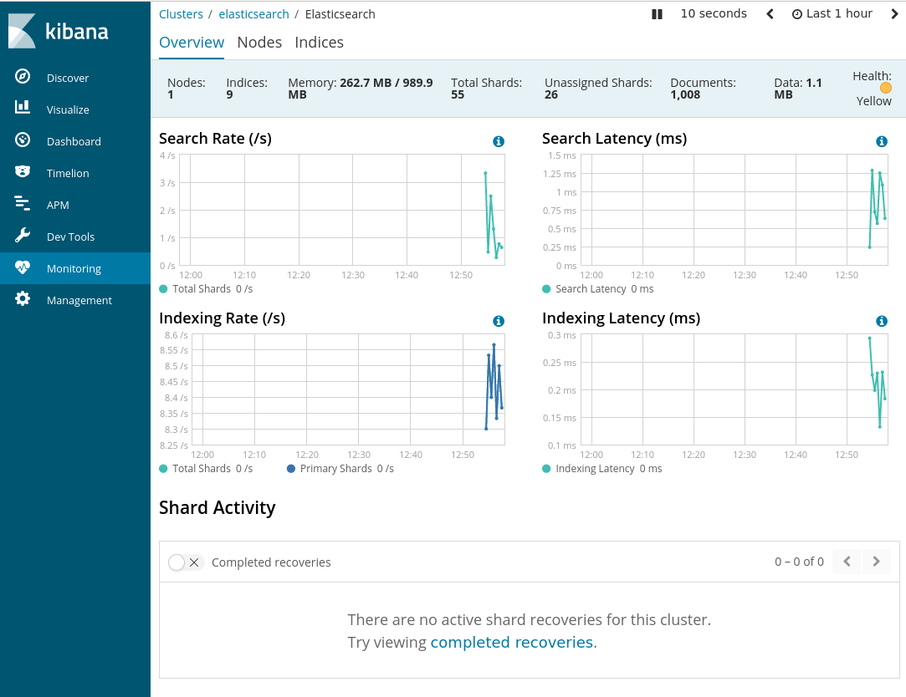

# Additional Services

<https://www.elastic.co/guide/en/elastic-stack-get-started/6.3/get-started-elastic-stack.html>

## Setup kibana

```bash 
wget https://artifacts.elastic.co/downloads/kibana/kibana-6.3.2-linux-x86_64.tar.gz
tar xzvf kibana-6.3.2-linux-x86_64.tar.gz
cd kibana-6.3.2-linux-x86_64/
./bin/kibana
```

* one can check its status at <http://127.0.0.1:5601>

## Setup metricbeat

* Debian 10

```bash
wget https://artifacts.elastic.co/downloads/beats/metricbeat/metricbeat-6.3.2-amd64.deb
sudo apt install ./metricbeat-6.3.2-amd64.deb
sudo metricbeat modules enable system
sudo metricbeat setup -e
sudo systemctl start metricbeat
```

* one can check its status at the following page:

<http://localhost:5601/app/kibana#/dashboard/Metricbeat-system-overview>

### Screenshots

||
| :---: |
|**Figure 1** kibana Elasticsearch screenshot. |

||
| :---: |
|**Figure 2** kibana Elasticsearch screenshot. |

||
| :---: |
|**Figure 3** kibana Elasticsearch screenshot. |

||
| :---: |
|**Figure 4** kibana Elasticsearch screenshot. |
