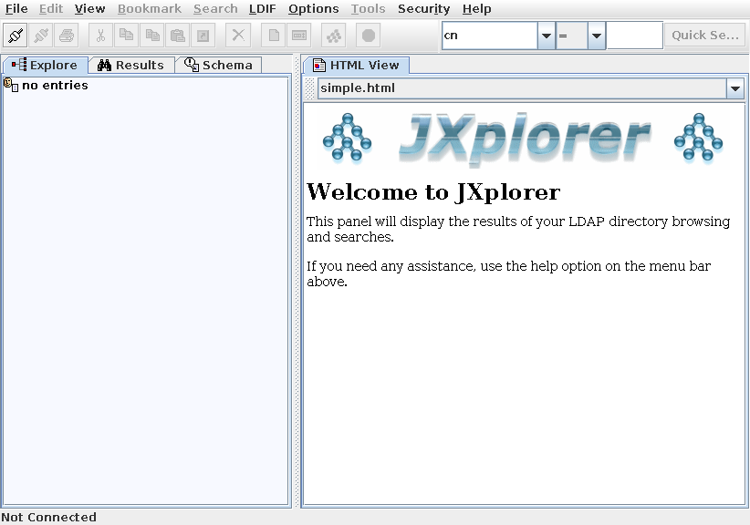
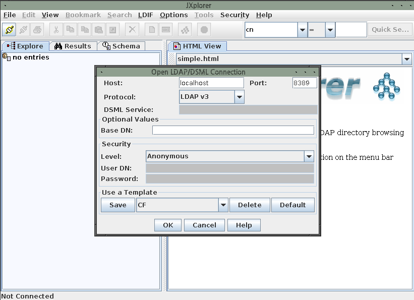
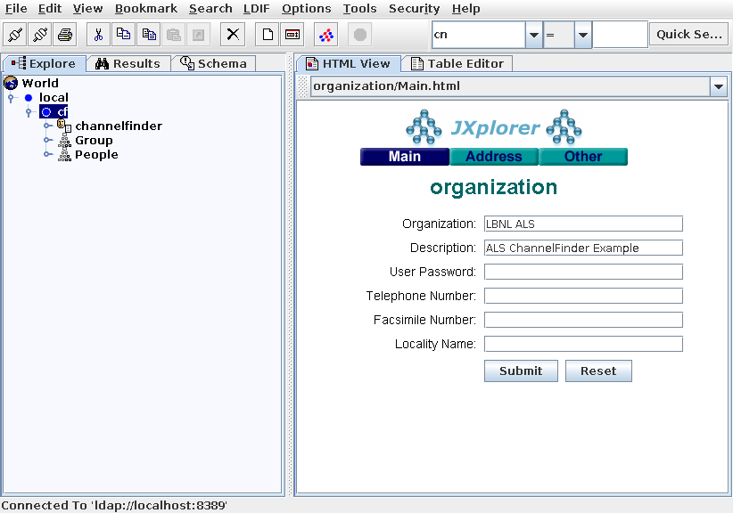
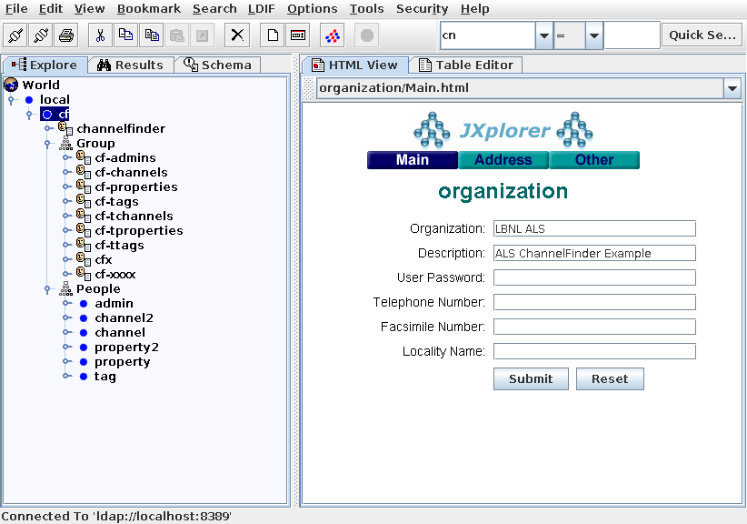

# Site-Specific Embedded LDAP Configuration

Configuration shown in ldif [1] files is an example which can help end-users to understand how LDAP works, **NOT**  a real configuration. Please don't put the real LDAP configuration into this repository.

## Useful Tool

* JXplorer [2] : JAVA LDAP browser and editor

## Procedures

* Change the `site-template/cf4als.ldif`. One can add a site-specific ldif file into `site-template` path, and use that name in `configure/CONFIG_SITE`. For example, one has `site-template/example.ldif`.

```bash
echo "CFLDIF_FILENAME:=example.ldif" > configure/CONFIG_SITE.local
```

* Check the ldif file is correctly defined

```bash
make vars
make PRINT.CFLDIF_FILENAME
```

* Restart CF

```bash
make restart
```

* Check the LDAF service via JXplorer

||
| :---: |
|**Figure 1** JXplorer screenshot. |

||
| :---: |
|**Figure 2** JXplorer screenshot. `Host` and `Port` should be matched with `embedded_ldap.urls` in application.properties.in  |

||
| :---: |
|**Figure 3** JXplorer screenshot. |

||
| :---: |
|**Figure 4** JXplorer screenshot. |

## References

[1] LDAP Data Interchange Format <https://tools.ietf.org/html/rfc2849>

[2] <http://www.jxplorer.org>

[3] <http://www.openldap.org/doc/admin24>
